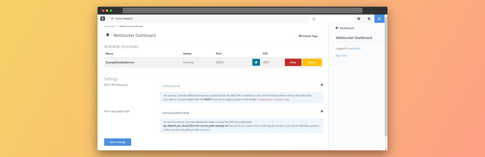

# 🌐🧱 Concrete WebSocket 🚀


  

**Add blazing-fast WebSocket support to Concrete CMS with ease! 🌈**



## 🎯 Features
* 🌐 **Multiple WebSocket Servers**: Run and manage multiple servers simultaneously.
* ⚡️ **Background Processes**: Keep your servers always online in the background.
* 🔄 **Process Management**: Effortlessly start, stop, and manage server processes.
* 🐧🪟 **Linux & Windows Support**: Seamlessly deploy on both operating systems. 
* 🎨 **Customization**: Tailor server port configuration to suit your unique requirements.
* 🧩 **Built-in Middlewares**: Enhance server functionality with ease.
* 🔒 **Secure REST API**: Manage servers remotely through a secure API.
* 📚 **Comprehensive Docs & Examples**: Access detailed documentation and practical example.

## 🚀 Installation
* 📥 **Download** the [latest release](https://github.com/Samurai016/concrete_websocket/releases/latest) package (*concrete_websocket.zip*)  
* 📂 **Unzip** the package in your /packages directory  
* 🌐 **Visit** your website's "Extend Concrete" page  
* 🚀 **Install** the package.  

## 📚 Usage
Run a custom WebSocket server effortlessly with our package. Based on [Ratchet PHP](http://socketo.me/), it opens up a world of real-time possibilities for your Concrete CMS site. 🚀  
> ⚠️ **Warning!**  
> The WebSocket servers are run outside Concrete environment, so, in the server class, you can't use classes or methods from the Concrete environment.

Follow our [example README](https://github.com/Samurai016/concrete_websocket/blob/master/example/README.md) to create a custom WebSocket server.

### 📊 Dashboard explaining
The package will automatically detect your server classes.  
* 🟢 **Start**: Click the *Start* button to launch the server.  
Now you can connect to your server via *ws://yourdomain:port/*
* 🔴 **Stop**: Click the *Stop* button to halt the server.
* 🔄 **Restart**: Click the *Restart* button to relaunch the server.

The **PID** column of the table is meant to be used for debugging and/or to track the process on your server.

## 🔧 WebSocketServer class

## 💡 Middlewares
New connections pass through the `getMiddlewares()` function, that returns an array of middlewares that are run as a LIFO queue (top to bottom).  

Each middleware is defined by a [`Middleware`](https://github.com/Samurai016/concrete_websocket/blob/master/websocket/src/middleware/Middleware.php) object comprising:
* `$class`: a class that must implements `Ratchet\Http\HttpServerInterface` interface.
* `$params`: an array of params passed to the `$class` constructor when the middleware is built (on server start from the dashboard).

### `ConcreteAuthentication` Middleware
The `ConcreteAuthentication` middleware restricts server access to logged-in users.
It checks the log status by querying a special endpoint defined by the package and closes the HTTP connection before protocol switching.

### 🔧 On Open
After the middlewares, the server switches to the WebSocket protocol, and the `onOpen` method is executed.
The base server's `onOpen` method adds the connection to the array of connected clients.  
To attach a connection, you can do it directly or by calling `parent::onOpen($conn);`.

More info [here](http://socketo.me/api/class-Ratchet.WebSocket.WsServer.html#_onOpen);

### 🔧 On Message
Every time a message is sent from clients, the `onMessage` function is run.  

More info [here](http://socketo.me/api/class-Ratchet.WebSocket.WsServer.html#_onMessage);

### 🔧 On Error
Every time an error occurs, the `onError` function is run.  

More info [here](http://socketo.me/api/class-Ratchet.WebSocket.WsServer.html#_onError);

### 🔧 On Close
Every time a connection is closed, the `onClose` function is run.  
The base server `onClose` method remove the connection from the array of connected clients. So, if you want to detach a connection you can do it directly or by calling `parent::onClose($conn);`.

More info [here](http://socketo.me/api/class-Ratchet.WebSocket.WsServer.html#_onClose);

## 🌐 REST API Documentation

Concrete WebSocket come up with a built-in REST API that allows you to control and monitor your servers remotely.
Refer to the [wiki](https://github.com/Samurai016/concrete_websocket/wiki/📚-REST-API-Documentation) for the documentation. ✨🔍

## 🤔 FAQ

### ❓ I got the `exec` disabled error, how can I enable it?
Enabling `exec` (or its equivalents) is crucial for concrete_websocket, and the method to enable it varies among webservers.  

> concrete_websocket offers support for multiple methods, so it is not necessarily mandatory to have exec enabled but it is enough that even only one of the supported methods is.  
> **The supported methods are:**
> * [`exec`](https://www.php.net/manual/en/function.exec.php)
> * [`shell_exec`](https://www.php.net/manual/en/function.shell-exec.php)
> * [`system`](https://www.php.net/manual/en/function.system.php)
> * [`proc_open`](https://www.php.net/manual/en/function.proc-open.php)
> * [`passthru`](https://www.php.net/manual/en/function.passthru.php)
> * [`popen`](https://www.php.net/manual/en/function.popen.php)

In general, you have to edit the `disable_functions` directive in your `php.ini` configuration file.  
Refer to your webserver's documentation for more information.

If you use one of the following admin panels, here are some useful links to edit the `php.ini`:
* [🛠️ CPanel](https://docs.cpanel.net/knowledge-base/security/how-to-edit-your-php-ini-file/)
* [🛠️ Plesk](https://support.plesk.com/hc/en-us/articles/213936565-How-to-find-and-edit-PHP-configuration-files-in-Plesk-for-a-domain-or-for-global-PHP-handler)
* 🛠️ ISPConfig  
You can edit php.ini for each site by modifying the field `Custom php.ini settings` in the _Options_ tab of the site page.

If you've made the changes but don't see them applied to your site, you may need to restart your webserver. 🔄

### ❌ I am unable to connect to WebSocket server due to insecure connection  
When you try to connect to a `ws://` unsecure connection from an `https://` secure connection, you may run into the following error message in the console:
```text
Mixed Content: The page at '...' was loaded over HTTPS, but attempted to connect to the insecure WebSocket endpoint 'ws://...'. This request has been blocked; this endpoint must be available over WSS.
```
This is because your browser prevent running unsecure connection from a secure environment.  

The easiest way to solve this is to configure a proxy server.

For Apache server (source: [StackOverflow](https://stackoverflow.com/questions/16979793/php-ratchet-websocket-ssl-connect#answer-28393526)):
* Enable `mod_proxy.so` and `mod_proxy_wstunnel.so`
* Add this lines to your `httpd.conf` file:
  ```
  ProxyPass /wss/ ws://yourdomain.com:port/
  ProxyPassReverse /wss/ ws://yourdomain.com:port/
  ```
* Restart your server with
  ```bash
  sudo systemctl restart apache2
  ```
* Now, instead of connecting to `wss://yourdomain.com:port/`, connect to `wss://yourdomain.com/wss` (without specifying the port and add the /wss path) 🔒

For Nginx users, [this solution](https://stackoverflow.com/questions/16979793/php-ratchet-websocket-ssl-connect#answer-43012985) may work, but I haven't personally tested it, so I can't guarantee its effectiveness. 🚀

### 🔍 concrete_websocket can't find my PHP executable path.
To configure concrete_websocket properly, you need to provide the PHP executable path of your server.  
During the package installation, we attempt to detect it automatically, but **there are cases where it might not be found**.  
In such situations, we ask you to manually provide the path in the WebSocket Dashboard settings form. 🛠️

❓**But how can you find your PHP executable path?**  
Here are the steps depending on your operating system and installation method:

#### 🪟 For Windows servers
1. Open the `cmd` command prompt.
2. Enter the following command in the prompt and press `Enter`:
   ```bash
   where php
   ```
   This command will display the path to the PHP executable. Copy and paste this path into the Concrete Dashboard settings form. 🖥️💻

#### 🐧 For Linux servers
1. Open the terminal.
2. Enter the following command in the terminal and press `Enter`:
   ```bash
   which php
   ```
   This command will display the path to the PHP executable. Copy and paste this path into the Concrete Dashboard settings form. 🖥️💻

Keep in mind that the provided solution is general and might not be applicable to your specific server setup. The exact answer depends on your configuration. ✨